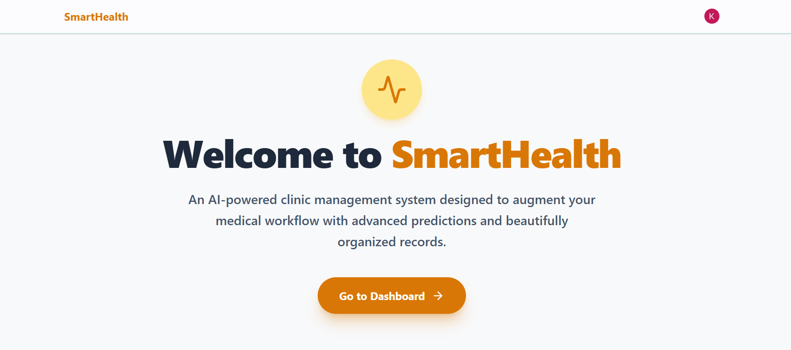
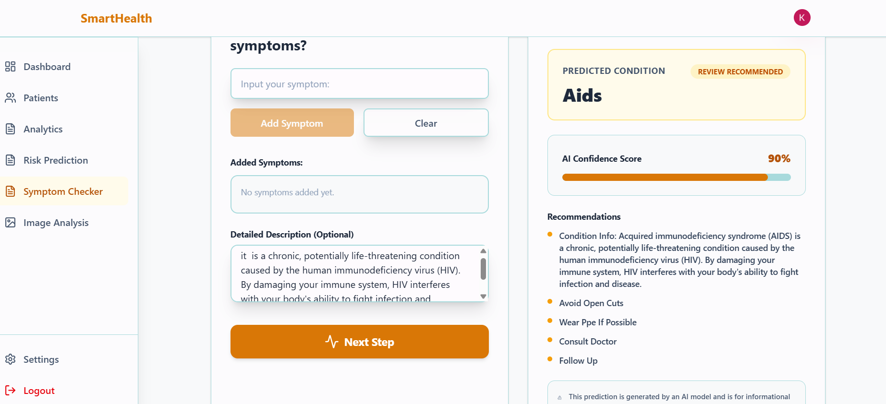

# 🏥 SmartHealth Predictor

[](https://fastapi.tiangolo.com/)
[](https://reactjs.org/)
[](https://vitejs.dev/)
[](https://tailwindcss.com/)
[](https://www.mongodb.com/)
[](https://scikit-learn.org/)
[](https://opencv.org/)
[](https://clerk.com/)

**SmartHealth Predictor** is an AI-powered clinic and patient intelligence management platform designed to assist healthcare professionals with disease diagnosis, cardiovascular risk assessment, medical imaging analysis, and patient record tracking.

---

## 📸 Screenshots

### 1. Landing & Welcome Portal


### 2. AI Symptom Checker & Disease Diagnosis


---

## 🌟 Key Features

### 🩺 1. AI Symptom Checker & Disease Prediction
- **Multi-Symptom Analysis:** Add discrete symptoms or provide detailed natural language descriptions of patient conditions.
- **Hybrid NLP + ML Engine:** Combines **Random Forest** classification with **TF-IDF cosine similarity** for semantic symptom matching and disease prediction.
- **Clinical Recommendations & Precautions:** Automatically surfaces clinical recommendations, precaution checklists, and confidence percentages.

### 🫀 2. Cardiovascular Risk Prediction
- **Clinical Parameter Modeling:** Evaluates vital biomarkers including resting blood pressure, cholesterol, fasting blood sugar, chest pain type, exercise-induced angina, ST depression (oldpeak), and number of major vessels.
- **Stratified Risk Scoring:** Categorizes cardiac risk levels (**Low**, **Moderate**, **High**, **Critical**) to support proactive triage and preventive intervention.

### 🩻 3. Medical Image & Scan Analysis (Computer Vision)
- **Automated Anomaly Detection:** Utilizes OpenCV for contour detection, Gaussian filtering, and Otsu thresholding to highlight structural variances.
- **Scan Quality & Tissue Variance:** Measures image sharpness (Laplacian variance), mean pixel intensity, and density variances on X-rays, MRIs, and CT scans.

### 👥 4. Patient Management System
- **Comprehensive Patient Records:** Track patient demographic profiles, vital signs, medical history, allergies, and diagnoses.
- **Timeline & History:** Maintain a continuous log of past assessments and test results.

### 📊 5. Clinical Analytics Dashboard
- **Visual Metrics:** Interactive charts and visualizations powered by Recharts for disease distribution, risk stratification, and patient intake trends.
- **Real-time Overview:** Quick glance statistics for active patients, pending reviews, and critical alerts.

### 🔐 6. Secure Authentication
- **Clerk Integration:** Enterprise-grade user authentication and access management for doctors, specialists, and clinical staff.

---

## 🏗️ System Architecture

```
SmartHealthPredictor/
├── client/                     # Frontend Application (React + Vite)
│   ├── src/
│   │   ├── Pages/              # Dashboard, SymptomChecker, Predictions, ImageAnalysis, Patients
│   │   ├── components/         # Navbar, Sidebar, Reusable UI Components
│   │   ├── hooks/              # Custom React Hooks
│   │   ├── services/           # Axios API Client & Endpoints
│   │   ├── App.jsx             # App Routing & Clerk Auth Wrappers
│   │   ├── main.jsx            # Entry Point
│   │   └── index.css           # Tailwind CSS Styling
│   └── package.json
│
├── server/                     # Backend Application (FastAPI)
│   ├── app/
│   │   ├── api/                # API Endpoints (Auth, Patients, Predictions, Symptoms, CV, Analytics)
│   │   ├── cv/                 # OpenCV Computer Vision Preprocessing & Analyzer
│   │   ├── database/           # MongoDB Motor Connection & Helpers
│   │   ├── ml/                 # ML Models, Preprocessing, Datasets & Inference Scripts
│   │   ├── models/             # Database ODM / PyMongo Models
│   │   ├── schemas/            # Pydantic Schemas & Data Validation
│   │   ├── services/           # Business Logic Services
│   │   ├── config.py           # Application Settings
│   │   └── main.py             # FastAPI App Entry & Router Mounts
│   └── requirements.txt
│
├── Screenshot1.png             # Landing Page Screenshot
├── Screenshot2.png             # Symptom Checker Screenshot
└── Readme.md                   # Documentation
```

---

## 🛠️ Tech Stack

| Domain | Technologies |
| :--- | :--- |
| **Frontend** | React 19, Vite, Tailwind CSS v4, Lucide Icons, Recharts, React Router v7 |
| **Backend** | Python 3.10+, FastAPI, Uvicorn, Pydantic, Python-Multipart |
| **Database** | MongoDB (Motor async driver / PyMongo) |
| **Machine Learning** | Scikit-learn, NumPy, Pandas, Joblib |
| **Computer Vision** | OpenCV (`opencv-python`) |
| **Authentication** | Clerk Auth (`@clerk/clerk-react`, `clerk-backend-api`) |

---

## 🚀 Getting Started

### Prerequisites
Make sure you have the following installed on your machine:
- **Node.js** (v18.0 or later)
- **Python** (v3.10 or later)
- **MongoDB** (Local instance or MongoDB Atlas URI)
- **Clerk Account** (For authentication keys)

---

### 1. Backend Setup

1. **Navigate to the server directory:**
   ```bash
   cd server
   ```

2. **Create and activate a virtual environment:**
   - **Windows (PowerShell):**
     ```powershell
     python -m venv .venv
     .venv\Scripts\Activate.ps1
     ```
   - **macOS / Linux:**
     ```bash
     python3 -m venv .venv
     source .venv/bin/activate
     ```

3. **Install dependencies:**
   ```bash
   pip install -r requirements.txt
   ```

4. **Configure environment variables:**
   Create a `.env` file in the `server/` directory:
   ```env
   MONGODB_URI=mongodb://localhost:27017/smarthealth
   FRONTEND_URL=http://localhost:5173
   CLERK_SECRET_KEY=your_clerk_secret_key_here
   MAX_UPLOAD_SIZE_MB=10
   ```

5. **Start the FastAPI backend server:**
   ```bash
   uvicorn app.main:app --reload --port 8000
   ```
   > 📖 The interactive API documentation will be available at: [http://localhost:8000/docs](http://localhost:8000/docs)

---

### 2. Frontend Setup

1. **Navigate to the client directory:**
   ```bash
   cd ../client
   ```

2. **Install dependencies:**
   ```bash
   npm install
   ```

3. **Configure environment variables:**
   Create a `.env` file in the `client/` directory:
   ```env
   VITE_CLERK_PUBLISHABLE_KEY=your_clerk_publishable_key_here
   VITE_API_BASE_URL=http://localhost:8000/api
   ```

4. **Start the development server:**
   ```bash
   npm run dev
   ```
   > 🌐 Open your browser and navigate to: [http://localhost:5173](http://localhost:5173)

---

## 📡 API Reference Overview

| Method | Endpoint | Description |
| :--- | :--- | :--- |
| `GET` | `/` | API Health Check |
| `POST` | `/api/symptoms/predict` | Predict diseases and precautions based on symptoms/descriptions |
| `POST` | `/api/predictions/heart-risk` | Predict cardiovascular risk score and category |
| `POST` | `/api/cv/analyze` | Upload and analyze medical scans (X-Ray / MRI / CT) |
| `GET` | `/api/patients/` | Retrieve patient list |
| `POST` | `/api/patients/` | Register a new patient record |
| `GET` | `/api/patients/{id}` | Get detailed patient info and diagnostic history |
| `GET` | `/api/analytics/dashboard` | Fetch aggregated clinic analytics & charts data |

---

## 🔒 Security & Privacy Notice

> [!WARNING]
> **Disclaimer:** SmartHealth Predictor is designed as an assistive diagnostic tool and clinical decision support system. It is **not** a replacement for professional medical judgment, laboratory testing, or physician consultation.

---

## 📄 License

This project is licensed under the **MIT License**.
